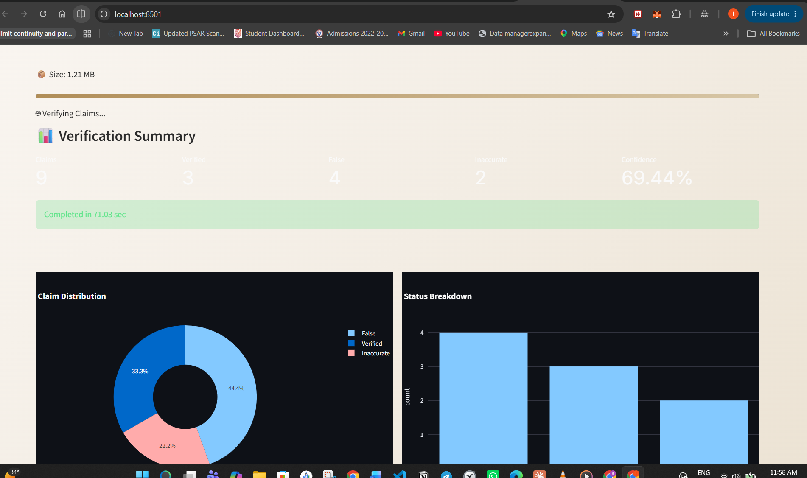
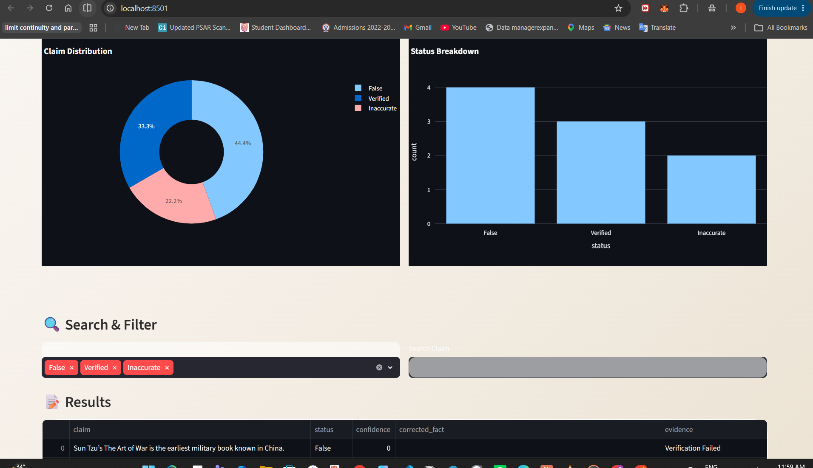
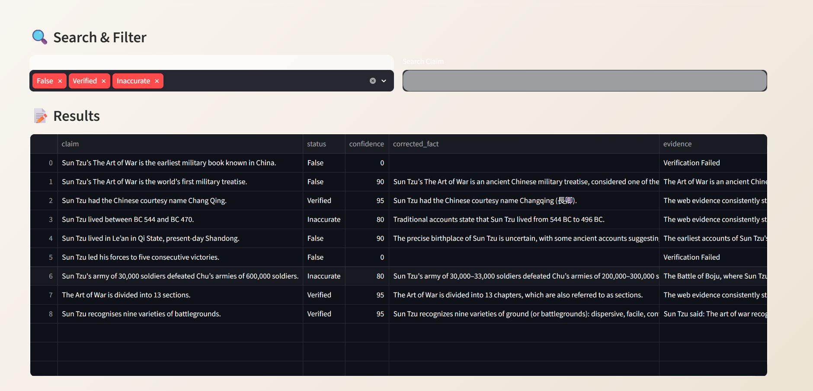

```markdown
# 🔎 FactCheck AI – PDF Fact Verification System

An AI-powered fact-checking web application that extracts factual claims from PDF documents, verifies them using live web evidence, and generates structured fact-checking reports.

Built using **Streamlit, Google Gemini, Tavily Search API, PyMuPDF, and Plotly Analytics**.
```markdown
# 🔎 FactCheck AI – PDF Fact Verification System

> ## ⚠️ Note for Evaluators
>
> The application was fully functional during development and testing. However, the free-tier Google Gemini API may occasionally return:
>
> - `429 RESOURCE_EXHAUSTED`
> - `503 UNAVAILABLE`
>
> due to free-tier quota limits and temporary model overload.
>
> The application architecture, PDF extraction pipeline, verification engine, analytics dashboard, and report generation modules have been implemented and tested successfully.
>
> A demo video and screenshots of successful executions have been included to demonstrate the application's functionality in case API quotas are exhausted during evaluation.
```
```markdown
# 📸 Application Screenshots

## Dashboard


---

## PDF Upload and Verification


---

## Analytics Dashboard


---

## Generated Report

```

---

# 🌐 Live Demo

👉 Deployed App: https://your-app-name.streamlit.app

👉 GitHub Repository: https://github.com/Ishansh10113/factcheck-agent

---

# 📌 Problem Statement

In today's digital era, documents often contain:

- Fake statistics
- Outdated information
- Misleading claims
- Unverified facts
- Incorrect numerical data

Manually verifying large documents is time-consuming and error-prone.

**FactCheck AI** automates this process by:

1. Extracting text from PDFs
2. Identifying factual claims
3. Searching live web evidence
4. Verifying claim authenticity
5. Generating downloadable reports and analytics

---

# ✨ Features

## 📄 PDF Upload
- Upload PDF documents directly through the browser.
- Supports multi-page documents.

---

## 🧠 AI Claim Extraction
Uses **Google Gemini** to:

- Detect factual statements
- Identify statistics and numerical claims
- Extract verifiable information

Examples:

- "India's population crossed 1.4 billion in 2023."
- "The Earth is 6,000 years old."
- "GDP grew by 8% in FY2024."

---

## 🌍 Live Web Verification
Uses **Tavily Search API** to fetch:

- Recent articles
- Trusted sources
- Supporting evidence
- Contradicting information

---

## ✅ Claim Classification

Each claim is categorized as:

### 🟢 Verified
Claim is supported by reliable evidence.

### 🟠 Inaccurate
Claim is partially true or outdated.

### 🔴 False
Claim is unsupported or factually incorrect.

---

## 📊 Analytics Dashboard

Interactive analytics including:

- Total Claims
- Verified Claims
- False Claims
- Inaccurate Claims
- Confidence Scores
- Status Distribution Pie Charts
- Verification Bar Charts

---

## 📥 Download Reports

Generate downloadable:

- CSV Reports
- Verification summaries
- Evidence reports

---

# 🏗 System Architecture

```

PDF Upload
↓
PyMuPDF Text Extraction
↓
Gemini Claim Extraction
↓
Tavily Web Search
↓
Claim Verification Engine
↓
Result Classification
↓
Analytics Dashboard
↓
CSV Report Generation

```

---

# 📂 Project Structure

```

factcheck-agent/
│
├── app.py
├── requirements.txt
├── README.md
│
├── services/
│   ├── factcheck_pipeline.py
│   ├── gemini_service.py
│   └── tavily_service.py
│
├── utils/
│   ├── claim_extractor.py
│   ├── config.py
│   ├── pdf_parser.py
│   ├── verifier.py
│   ├── web_search.py
│   ├── report_generator.py
│   └── helpers.py
│
├── models/
│   ├── claim.py
│   └── result.py
│
├── prompts/
│   ├── claim_extraction.txt
│   └── verification_prompt.txt
│
├── static/
│   ├── style.css
│   ├── animation.css
│   ├── logo.png
│   └── bg.jpg
│
├── reports/
├── logs/
└── uploads/

````

---

# ⚙️ Tech Stack

| Technology | Purpose |
|------------|----------|
| Python | Backend |
| Streamlit | Web Application |
| Google Gemini API | Claim Extraction |
| Tavily API | Web Search & Evidence |
| PyMuPDF | PDF Parsing |
| Pandas | Data Processing |
| Plotly | Analytics Dashboard |
| HTML/CSS | Custom UI |

---

# 🚀 Installation

## Clone Repository

```bash
git clone https://github.com/Ishansh10113/factcheck-agent.git
cd factcheck-agent
````

---

## Create Virtual Environment

### Windows

```bash
python -m venv venv
venv\Scripts\activate
```

### Linux/Mac

```bash
python3 -m venv venv
source venv/bin/activate
```

---

## Install Dependencies

```bash
pip install -r requirements.txt
```

---

# 🔑 Environment Variables

Create a `.env` file:

```env
GEMINI_API_KEY=YOUR_GEMINI_KEY
TAVILY_API_KEY=YOUR_TAVILY_KEY
MODEL_NAME=gemini-2.0-flash
MAX_FILE_SIZE_MB=10
```

---

# ▶️ Run Application

```bash
streamlit run app.py
```

Application starts at:

```
http://localhost:8501
```

---

# 📊 Workflow

### Step 1

Upload PDF document.

### Step 2

Extract text using PyMuPDF.

### Step 3

Gemini identifies factual claims.

### Step 4

Tavily searches live evidence.

### Step 5

Verification engine classifies claims.

### Step 6

Dashboard displays analytics.

### Step 7

Generate downloadable report.

---

# 📈 Example Output

| Claim                                          | Status     | Confidence |
| ---------------------------------------------- | ---------- | ---------- |
| India's population crossed 1.4 billion in 2023 | Verified   | 95%        |
| Earth is 6000 years old                        | False      | 98%        |
| GDP grew by 8% in FY2024                       | Inaccurate | 78%        |

---

# ⚠️ Known Limitations

* Free-tier Gemini APIs may experience rate limits.
* Large PDFs may require chunked processing.
* Verification quality depends on available web sources.

---

# 🔮 Future Improvements

* Multi-model fallback (Gemini + OpenAI)
* OCR support for scanned PDFs
* Semantic similarity scoring
* Multi-language fact checking
* PDF annotation and highlighting
* Batch document processing
* Advanced analytics dashboard

---

# 👨‍💻 Developer

**Ishansh Bhardwaj**

B.Tech (Artificial Intelligence & Machine Learning)

National Finalist – HackIndia 2024

Passionate about AI, Machine Learning, Data Science and Building Real-World AI Applications.

GitHub:
https://github.com/Ishansh10113

LinkedIn:
https://www.linkedin.com/in/ishansh-bhardwaj-24702116b/

---

# 📜 License

This project is developed for educational and evaluation purposes as part of an AI Fact-Checking System assignment.

```
```
